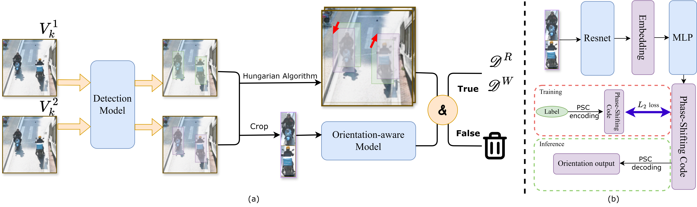
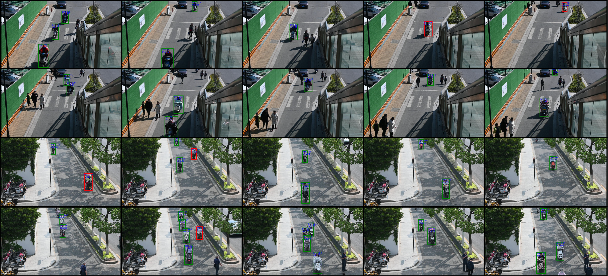

# Fast Wrong-way Cycling Detection in CCTV Videos: Sparse Sampling is All You Need

This is the official repository for the paper **"Fast Wrong-way Cycling Detection in CCTV Videos: Sparse Sampling is All You Need"**, accepted by **IEEE Transactions on Intelligent Transportation Systems (T-ITS)**.



## Introduction

We propose the **Wrong-Way Cycling Predictor (WWC-Predictor)**, a lightweight method designed to efficiently estimate wrong-way cycling ratio using significantly fewer frames and less computational resources. This is achieved through sparse sampling supported by a Two-Frame WWC Detector, which precisely extracts orientation-based counts from each pair of frames. 

To mitigate orientation errors caused by detection in sparse sampling (e.g., occlusion ambiguities), we introduce an ensemble method to cross-validate the cycling orientations detected in each pair of frames. Subsequently, a temporal WWC estimator applies an **ARMA** model to convert validated frame-level counts into a video-level wrong-way cycling ratio.

## Requirements

The codebase is built on top of [MMYOLO](https://github.com/open-mmlab/mmyolo).

### Installation

1.  **Install dependencies using MIM:**

    ```bash
    pip install -U openmim
    mim install -r mmyolo/requirements/mminstall.txt
    ```

2.  **Install MMYOLO:**

    ```bash
    mim install -r mmyolo/requirements/albu.txt
    mim install "mmyolo"
    ```

## Data Preparation

All the datasets are available at [Hugging Face](https://huggingface.co/datasets/CATTAC/wrong-way-cycling).

This repository contains several scripts in `dataset_scripts/` for different purposes:

*   **`dataset_scripts/Frame_extraction_2.py`**: Extracts frame pairs with a fixed interval. This is used for the **Sparse Sampling** inference/validation process described in the paper.
*   **`dataset_scripts/Frame_extraction.py`**: Extracts single frames. Used for **Detection Model** training data preparation.
*   **`dataset_scripts/Frame_extraction_angle.py`**: Extracts frames for **Angle Prediction Model** pre-training data preparation.

## Usage

### Whole Pipeline Inference (WWC-Predictor)

**Step 1. Generate Data from Video (Sparse Sampling)**

Use the `Frame_extraction_2.py` script to extract frame pairs from your video.

```bash
python dataset_scripts/Frame_extraction_2.py --name <VideoName> --Eg <ExpectedGap>
```

**Step 2. Run Inference**

Navigate to the `mmyolo/` directory:

```bash
cd mmyolo
```

*   **WWC-Predictor (Proposed Method with ARMA):**
    
    The implementation is in `ARMA_detect_pipeline.py`. 
    
    *Note: Please configure the `video_path` and `eg` parameters inside `ARMA_detect_pipeline.py` before running.*

    ```bash
    python ARMA_detect_pipeline.py
    ```

*   **Orientation-aware Model Method (Comparison):**

    ```bash
    python anglepred_pipeline.py --name <VideoName> --Eg <ExpectedGap>
    ```

### Training

#### Detection Model Training & Testing

Navigate to `mmyolo/`:

```bash
cd mmyolo
```

**Training:**
```bash
python tools/train.py configs/custom/5s.py
```

**Testing:**
```bash
python tools/test.py configs/custom/5s.py %path/to/checkpoint.pth% --show-dir %path/to/folder/to/save/results%
```

#### Orientation-aware Model Training

Navigate to `angle_prediction/`:

```bash
cd angle_prediction
```

The `angle_prediction` directory contains the following key scripts:
*   `main.py`: The main training script for the angle prediction model (supports both pre-training and fine-tuning).
*   `test.py`: Script for evaluating the model on the validation dataset.

**Training Command:**
```bash
# Pretraining
python main.py --data_path /path/to/dataset/

# Finetuning
python main.py --data_path /path/to/dataset/ --resume /path/to/checkpoint/
```

## Qualitative Results



## License

Please check the [LICENSE](LICENSE) file.
